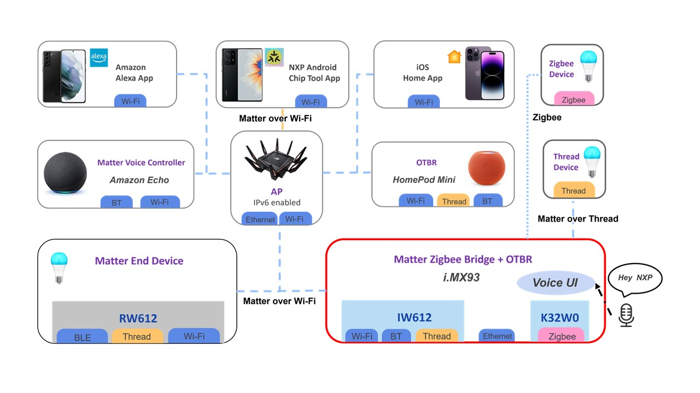
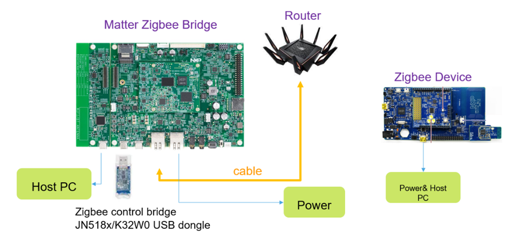

# Matter Zigbee Bridge voice UI

 Zigbee devices can join the Matter network through the Matter-Zigbee Bridge. The Bridge can through Ethernet or wifi to join in Matter Network. In addition, add voice UI feature to control the Matter
 devices.

Support Zigbee devices type: 
* `Lighting` 
* `Temperature Sensor`

Voice UI support devices
* `Lighting`

## Topology


## Hardware

Hardware Requirements

* Router
* An i.MX93 EVK board
* A USB K32W061 Dongle, a K32W061 DK6 EVK, a OM15081-2 board
* An OTBR `(Optional)`

<br />




## Build Guide
You can build NXP Matter Zigbee brige form source code or download pre-build image form [nxp.matter demo image](https://www.nxp.com/design/design-center/development-boards-and-designs/i-mx-evaluation-and-development-boards/mpu-linux-hosted-matter-development-platform:MPU-LINUX-MATTER-DEV-PLATFORM) directly. Can be any version.

### 1. Matter bridge build
* if download demo image, the app is under `/usr/bin/imx-chip-bridge-app`
* How to generate yocto sdk refer to [ How to build OpenThread Border Router with the Yocto SDK](https://github.com/nxp-imx/meta-nxp-connectivity?tab=readme-ov-file#how-to-build-openthread-border-router-with-the-yocto-sdk)
* How to build Matter Zigbee Bridge app : https://github.com/NXP/matter/blob/v1.3-branch-nxp_imx_2024_q2/examples/bridge-app/nxp/linux-imx/README.md#building
  
`reference:`
* [Matter Zigbee bridge user guide](https://github.com/NXP/matter/blob/v1.3-branch-nxp_imx_2024_q2/examples/bridge-app/nxp/linux-imx/README.md)
* [meta-nxp-connectivity](https://github.com/nxp-imx/meta-nxp-connectivity)
###

### 2. Setup network
```sh
# 1. Add Zigbee brige into MatterNetwork 
$ imx-chip-bridge-app &
# 2. Onnetwork pairing
$ chip-tool pairing onnetwork 8888 20202021
# 3. Allow Zigbee Device join
$ chip-tool actions instant-action  0x1002  8888 1
# 4. Add Zigbee Blub (Factory reset the Blub to the join status)
# refer to the instruction manual of the Zigbee Blub

# 5. test whether the blub can be controlled
$ chip-tool onoff toggle 8888 3
```

### 3. Setup voice UI
```sh
$ git clone -b 2024q2 https://github.com/nxp-imx-support/bridge-voice-ui.git
$ cd bridge-voice-ui
# source yocto sdk
$ source opt/fsl-imx-xwayland/6.1-langdale-imx93/enviroment
# run build script
$ ./build.sh
# install app to imx93 evk
$ scp bridge_release/release/voice_ui_app root@<evk ip>:/root
$ scp bridge_release/release/libvoiceseekerlight.so.2.0 root@<evk ip>:/usr/lib/nxp-afe
$ scp bridge_release/WakeWordNotify root@<evk ip>:/usr/bin
$ scp bridge_release/WWCommandNotify root@<evk ip>:/usr/bin
$ scp bridge_release/chip-tool.py root@<evk ip>:/root

# setup enviroment on imx93evk
$ pip3 install posix-ipc
$ modprobe snd-aloop
$ ln -s /usr/lib/nxp-afe/libvoiceseekerlight.so.2.0 /usr/lib/nxp-afe/libvoiceseekerlight.so
$ ./voice_ui_app -notify &
$ /unit_tests/nxp-afe/afe libvoiceseekerlight &
$ python3 chip-tool.py &
```
### voice UI
Say "Hey NXP" will wake up system.  
Say "Power on", light will power on. or Say "Power off", the light will power off.